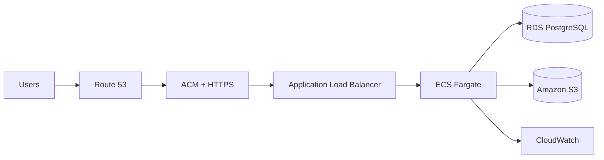

<!-- Animated GitHub Profile README for github.com/Keerthivasan31 -->


<div align="center">

<a href="https://git.io/typing-svg"></a>

<br />

[](https://www.linkedin.com/in/keerthivasan-d-43b205370)
[](mailto:keerthivasan3182001@gmail.com)
[](https://github.com/Keerthivasan31)

<br />


</div>

<br />

<table><tr><td width="58%" valign="top">

## `> whoami` 👨‍💻

Entry-level **AWS & DevOps Engineer** who enjoys turning source code into secure, repeatable, and observable cloud deployments.

- ☁️ Building with AWS, containers, and infrastructure as code
- 🔁 Automating build, test, and deployment workflows
- 📦 Developed a **10-service food delivery platform**
- 📊 Focused on monitoring, reliability, and cloud security
- 🌱 Growing in Kubernetes/EKS, Terraform, and Ansible
- 💼 Open to Cloud, AWS, and DevOps engineering opportunities

</td><td width="42%" valign="top">

## `> status` ⚡

```yaml
role: AWS & DevOps Engineer
education: B.E. Information Technology
mission: Build. Automate. Deploy.
currently_learning:
  - Kubernetes & Amazon EKS
  - Terraform & Ansible
  - Cloud Observability
availability: Open to Work
```

</td></tr></table>


## 🧰 Technology Arsenal

<div align="center">

### ☁️ Cloud • DevOps • Infrastructure

<a href="https://skillicons.dev"></a>

### 💻 Development • Scripting • Data

<a href="https://skillicons.dev"></a>

</div>

<br />

<div align="center">


<code>ALB</code> • <code>ACM</code> • <code>Route 53</code> • <code>IAM</code> • <code>VPC</code> • <code>ECR</code> • <code>CloudTrail</code> • <code>SNS</code> • <code>REST APIs</code> • <code>JWT</code>

</div>

<br />


## 🚀 Flagship Project

<div align="center">

### Food Delivery Microservices Platform on AWS


</div>

> Production-oriented AWS and DevOps project combining microservices, containerization, automated delivery, infrastructure as code, managed data, monitoring, security, and event-driven notifications.



<details><summary><b>⚙️ Explore the architecture and delivery pipeline</b></summary>
<br />

- **Applications:** Five React/Vite frontends and five Node.js/Express microservices
- **Containers:** Ten Docker images stored in Amazon ECR
- **Infrastructure:** Reusable AWS CloudFormation templates
- **CI/CD:** Jenkins validation, image builds, ECR pushes, ECS deployments, and health verification
- **Data:** PostgreSQL on Amazon RDS with S3-backed image storage
- **Operations:** CloudWatch monitoring, CloudTrail auditing, health checks, and autoscaling
- **Events:** SNS-based order notifications
- **Security:** JWT authentication, IAM access controls, ACM HTTPS, and VPC networking

```text
Source → Jenkins → Test → Docker Build → Amazon ECR → ECS Deploy → Health Check
```

</details>

## 🧪 More Projects

<table><tr><td width="50%" valign="top">

### 🌊 Plastic Waste Detection

Deep-learning solution designed to detect plastic waste in water bodies as a final-year engineering project.

</td><td width="50%" valign="top">

### 📦 Stock Management System

Diploma project for organizing inventory records, monitoring availability, and supporting daily stock operations.

</td></tr></table>


## 📊 Live GitHub Dashboard

<div align="center">


<br />


<br />


<br />


</div>

> GitHub cards reflect activity in accessible public repositories; they are not a complete measure of engineering ability.

## 🐍 Animated Contribution Journey

<div align="center">

<picture>
  <source media="(prefers-color-scheme: dark)" srcset="https://raw.githubusercontent.com/Keerthivasan31/Keerthivasan31/output/github-contribution-grid-snake-dark.svg" />
  <source media="(prefers-color-scheme: light)" srcset="https://raw.githubusercontent.com/Keerthivasan31/Keerthivasan31/output/github-contribution-grid-snake.svg" />
  
</picture>

</div>

## 🎓 Journey & Credentials

<details open><summary><b>🎓 Education</b></summary>
<br />

- **B.E. Information Technology** — Annamalai University, Chidambaram | 2023–2026 | CGPA: 7.18/10
- **Diploma in Computer Science Engineering** — Annai Vellankanni Polytechnic College, Panruti | 2019–2022 | 84%

</details>

<details><summary><b>☁️ Professional Training</b></summary>
<br />

- **Master in Cloud Computing — AWS & DevOps** — FITA Academy | Four-month program | 2026
- **MERN Full Stack Development** — Novitech | One-month course | 2026

</details>

<details><summary><b>💼 Internships</b></summary>
<br />

- **Prompt Engineering with Generative AI** — Widezo Private Limited | 2025
- **Internet of Things** — Power Integrated Solutions & AIIRF-EDII | 2024

</details>

## 🎯 Current Mission

```yaml
learning_path:
  kubernetes: Amazon EKS and production workloads
  terraform: Modules, state, and reusable infrastructure
  ansible: Repeatable configuration automation
  observability: Metrics, logs, alerts, and reliability

career_goals:
  - Build secure and reliable cloud platforms
  - Automate software delivery from commit to production
  - Grow into an excellent AWS and DevOps engineer
```

## 🤝 Let's Build Something Reliable

<div align="center">

I am looking for an entry-level engineering opportunity where I can contribute to cloud infrastructure, delivery automation, and platform reliability while learning from a strong technical team.

<br />

[](https://www.linkedin.com/in/keerthivasan-d-43b205370)
[](mailto:keerthivasan3182001@gmail.com)
[](https://github.com/Keerthivasan31)

<br />

<a href="https://git.io/typing-svg"></a>

</div>


